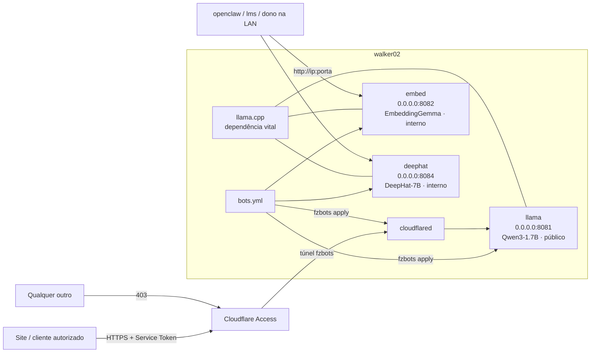

# fzmultibotbackend

**PT** | [EN below](#english)

Backend de bots do walker02: modelos locais (llama.cpp) servidos para sites pela internet
via Cloudflare Tunnel + Access, e para a rede local direto. Cada bot é independente e
escolhe seu próprio modelo. `bots.yml` declara; `fzbots` aplica, confere e opera.

## Como funciona



## Instalar (uma linha, como root)

```bash
curl -fsSL https://raw.githubusercontent.com/RLuf/fzmultibotbackend/master/install.sh | bash
```

Instala dependências (apt), o comando `fzbots` e o completion; se não houver llama.cpp, oferece
compilar com `scripts/build-llama.sh`. Detalhes: [`docs/pt/instalar.md`](docs/pt/instalar.md).

Detalhes: [`docs/pt/arquitetura.md`](docs/pt/arquitetura.md) · Decisões e porquês: [`docs/adr/`](docs/adr/) · llama.cpp: [`docs/pt/llama-cpp.md`](docs/pt/llama-cpp.md)

- **1 bot = 1 porta + 1 llama-server + 1 modelo.** Bot público tem também 1 hostname.
  Adicionar bot = bloco no `bots.yml` + `fzbots apply --restart` (ver `docs/pt/adicionar-bot.md`).
- Todo bot escuta em `0.0.0.0`: local, LAN e (se tiver hostname) internet pelo túnel. Sem porta aberta no roteador.
- Acesso pela internet exige Service Token **e** vir da rede autorizada; o resto leva 403.
- A trava de VRAM soma o que o `bots.yml` estima com o que terceiros (lms, etc.) usam de verdade na GPU.

## Bots ativos

| Bot | Unit | Porta | Hostname | Modelo | Uso |
|---|---|---|---|---|---|
| llama | fzbots-llama | 8081 | fzbots.rogerluft.com.br | Qwen3-1.7B Q4_K_M (~1,6 GB VRAM) | sites (público) |
| embed | fzbots-embed | 8082 | — | EmbeddingGemma 300M Q8_0 (~0,5 GB) | embeddings; consumidor: openclaw |
| deephat | fzbots-deephat | 8084 | — | DeepHat-V1-7B Q4_K_M (~3,3 GB, `--fit`) | só openclaw; **nunca** público |

O embedder usa batch lógico e físico de 2048 tokens, alinhado à janela do modelo. O deephat
usa `--fit on` para dividir GPU/CPU e caber ao lado dos outros.

**Bots internos NÃO entram no túnel.** `tunel: false` = unit + porta, sem ingress e sem hostname;
continuam acessíveis na LAN.

## TUI — `fzbots tui`

O único comando que você precisa lembrar. Painel (estado, VRAM, site, consumidores), Modelos
(o que há no disco, VRAM estimada pelo cabeçalho GGUF, novo bot com flags sugeridas, download
do Hugging Face), Chat, Logs e Endpoints. Ver [`docs/pt/tui.md`](docs/pt/tui.md).


## Operação

```bash
bin/fzbots apply [--restart] [--prune]  # aplica o bots.yml (units + ingress); --prune remove órfãs
bin/fzbots check                        # drift: bots.yml vs host (units, processos, ingress, GPU real)
bin/fzbots status                       # saúde de tudo (llama.cpp, túnel, bots, drift, GPU)
bin/fzbots start|stop|restart|logs <bot>
bin/fzbots url [bot]                    # URLs local / rede / túnel
bin/fzbots list | render <bot|ingress> | vram
bin/fzbots chat <bot> [-m "pergunta"]  # conversa (stream) com um bot; fzbots embed <bot> "texto"
bin/fzbots modelos                      # .gguf no disco: tamanho, quant, VRAM estimada, quem usa
bin/fzbots flags <modelo.gguf> --ctx N  # sugere extra_args otimizados (cabe na GPU? --fit, -fa, KV q8_0…)
bin/fzbots baixar <repo-hf> [arquivo]   # baixa um .gguf do Hugging Face para modelos_dir
bin/fzbots undo                         # remove units fzbots-* e zera o ingress (não toca túnel/Access)
scripts/test-tunnel.sh                  # testa os bots públicos pelo túnel (credencial do arquivo 600)
```

`scripts/aplicar.sh`, `scripts/status.sh` e `scripts/undo.sh` continuam existindo como atalhos.
Testes: `PYTHONPATH=. python3 -m unittest -v tests.test_config` (validação do yml) e
`PYTHONPATH=. python3 tests/tui_headless.py` (TUI sem terminal, gera os screenshots).

Credenciais e instruções de acesso: `/root/walker02-tunnel-access.txt` (600).
Consumidores externos (openclaw, lms): [`docs/pt/consumidores-externos.md`](docs/pt/consumidores-externos.md).
Documentação completa: [`docs/pt/`](docs/pt/) · Design: [`docs/plans/`](docs/plans/)

## Consumidores externos

openclaw e LM Studio (`lms`) **não fazem parte** deste projeto: usam os endpoints do llama-server
direto, sem adapters (ADR 0007). O projeto Pangeia (`../pangeia`, cluster de GPU entre máquinas)
é outro produto; seu runbook usa a porta 8081 — não subir os dois ao mesmo tempo.

---

## English

Bot backend for walker02: local models (llama.cpp) served to websites over the internet
through Cloudflare Tunnel + Access, and to the LAN directly. Each bot is independent and
picks its own model. `bots.yml` declares; `fzbots` applies, checks and operates.

- **1 bot = 1 port + 1 llama-server + 1 model.** A public bot also has 1 hostname.
  Adding a bot = a block in `bots.yml` + `fzbots apply --restart` (see `docs/en/add-bot.md`).
- Every bot binds `0.0.0.0`: local, LAN and (with a hostname) the internet through the tunnel.
  No router ports opened.
- Internet access requires a Service Token **and** an authorized source network; everything else gets 403.
- The VRAM guard adds what `bots.yml` estimates to what third parties (lms, etc.) really use on the GPU.
- Architecture: `docs/en/architecture.md` · ADRs (English summary): `docs/en/adr.md` · llama.cpp: `docs/en/llama-cpp.md`.

TUI: `fzbots tui` — the only command to remember (panel, models, chat, logs, endpoints; see
`docs/en/tui.md`). Install (as root): `curl -fsSL https://raw.githubusercontent.com/RLuf/fzmultibotbackend/master/install.sh | bash`
(see `docs/en/install.md`).

Active bots: see the table above. Operations: `fzbots apply|check|status|start|stop|restart|logs|url|chat|embed|modelos|flags|baixar|undo`,
`scripts/test-tunnel.sh`. Credentials live in `/root/walker02-tunnel-access.txt` (mode 600).
Full docs in [`docs/en/`](docs/en/).

openclaw and LM Studio are external consumers, not part of this project (ADR 0007). Pangeia
(`../pangeia`, multi-machine GPU cluster) is a different product; its runbook uses port 8081 —
never run both at once.
