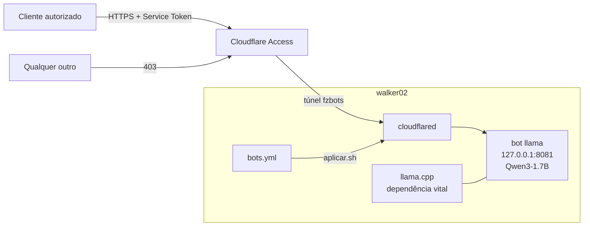

# fzmultibotbackend

**PT** | [EN below](#english)

Backend de bots do walker02: modelos locais (llama.cpp) servidos com segurança
pela internet via Cloudflare Tunnel + Access. Cada bot é independente e escolhe
seu próprio modelo.

## Como funciona



Detalhes: [`docs/pt/arquitetura.md`](docs/pt/arquitetura.md) · Decisões e porquês: [`docs/adr/`](docs/adr/) · llama.cpp: [`docs/pt/llama-cpp.md`](docs/pt/llama-cpp.md)

- **1 bot = 1 hostname + 1 llama-server + 1 modelo.** Adicionar bot = nova
  entrada no ingress + novo serviço systemd (ver `docs/pt/adicionar-bot.md`).
- API nunca escuta na rede — só `127.0.0.1`. Sem porta aberta no roteador.
- Acesso exige Service Token **e** vir da rede autorizada; o resto leva 403.

## Bots ativos

| Bot | Hostname | Porta local | Modelo | Uso |
|---|---|---|---|---|
| fzbots | fzbots.rogerluft.com.br | 8081 | Qwen3-1.7B Q4_K_M (~1,6 GB VRAM) | bots/sites |

**Modelos privados NÃO entram no túnel** — só os bots declarados no `bots.yml`
ganham hostname público.

## Operação

```bash
scripts/aplicar.sh      # aplica o bots.yml (fonte da verdade) no sistema
scripts/status.sh       # saúde de tudo (serviços, túnel, GPU, API)
scripts/test-tunnel.sh  # testes pelo túnel (lê credencial do arquivo 600)
scripts/undo.sh         # desfaz tudo e volta ao estado anterior
```

Credenciais e instruções de acesso: `/root/walker02-tunnel-access.txt` (600).
Documentação completa: [`docs/pt/`](docs/pt/) · Design: [`docs/plans/`](docs/plans/)

---

## English

Bot backend for walker02: local models (llama.cpp) served securely to the
internet through Cloudflare Tunnel + Access. Each bot is independent and picks
its own model.

- **1 bot = 1 hostname + 1 llama-server + 1 model.** Adding a bot = a block in
  `bots.yml` + `scripts/aplicar.sh` (see `docs/en/add-bot.md`).
- Architecture and ADRs (why each decision was made): `docs/pt/arquitetura.md`,
  `docs/adr/`. The vital dependency (llama.cpp build): `docs/en/llama-cpp.md`.
- The API only listens on `127.0.0.1` — no router ports opened.
- Access requires a Service Token **and** an authorized source network;
  everything else gets 403.

Active bots: see table above. Operations: `scripts/status.sh`,
`scripts/test-tunnel.sh`, `scripts/undo.sh`. Credentials live in
`/root/walker02-tunnel-access.txt` (mode 600). Full docs in [`docs/en/`](docs/en/).
