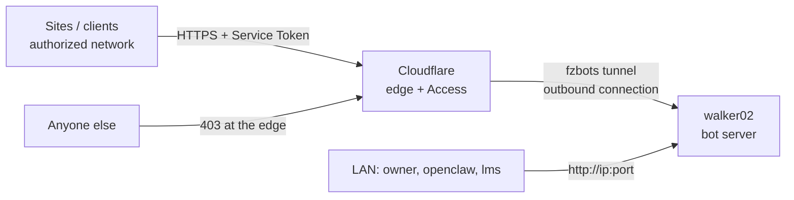
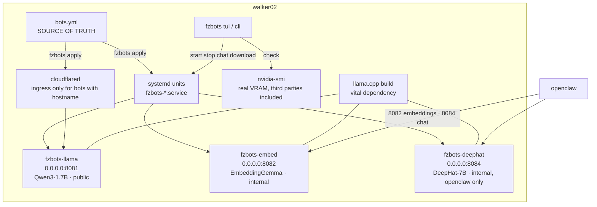

# Architecture — fzmultibotbackend

Simplified C4 (levels 1 and 2). Decisions and reasons: `docs/adr/` (Portuguese; English summary in `docs/en/adr.md`).

## Level 1 — the system in the world

## Level 2 — inside walker02

## Request flow (public bot)

1. Client calls `https://<hostname>/v1/chat/completions` with the two Service Token headers.
2. Cloudflare Access checks: valid token **and** source IP in the authorized network. Fail → 403.
3. Pass → through the tunnel → cloudflared delivers to `127.0.0.1:<port>` of the bot owning that hostname.
4. llama-server answers; same way back.

On the LAN the path is direct: `http://<walker02-ip>:<port>/v1/...` (see `fzbots url`).

## Modules

| Module | Where | Role |
|---|---|---|
| Declaration | `bots.yml` | name, port, model, estimated VRAM, flags, hostname, `tunel`, `consumidores` |
| `fzbots/config.py` | package | load, validate (keys, name, unique port/hostname, boolean `tunel`), render unit + ingress |
| `fzbots/systemd.py` | package | `apply` (validate everything, archive, atomic write), `check` (drift on 5 axes), `prune`, start/stop/restart/logs, `undo` |
| `fzbots/gpu.py` | package | real VRAM per process/unit via nvidia-smi + cgroup; guard = yml + third parties ≤ GPU |
| `fzbots/cli.py` | package | `fzbots apply|check|status|list|render|start|stop|restart|logs|url|vram|undo` |
| `scripts/*.sh` | shortcuts | `aplicar.sh`, `status.sh`, `undo.sh` call the CLI; `test-tunnel.sh` probes public bots through the tunnel |

## What `fzbots check` verifies (drift)

a) every unit in `/etc/systemd/system` is byte-equal to the yml render; ingress equal ·
b) orphan `fzbots-*` units (not in the yml) and who depends on them ·
c) running process × unit ExecStart (unit changed without restart), pending `daemon-reload` ·
d) cloudflared active and config newer than its start ·
e) real GPU: yml sum + third-party VRAM ≤ `gpu_vram_gb`; a bot using > 1.3× its estimate; a bot port held by a foreign process.

## Invariants (never change without an explicit owner decision)

- Every bot binds `0.0.0.0` (ADR 0006). The tunnel is the only entry from the internet.
- 1 bot = 1 port + 1 unit + 1 model (process isolation, ADR 0004). A public bot also has 1 hostname.
- `bots.yml` → `fzbots apply` is the only way units/ingress change (ADR 0003).
- Only a bot with `hostname` and without `tunel: false` gets an ingress. `deephat` is never public.
- openclaw and lms are external consumers, no adapters (ADR 0007).
- Port 8081 is reserved for the public bot `llama` (the Pangeia project's runbook also uses 8081 — never run both at once).
- Extra security is handled by the owner in other layers — not in this repo.
