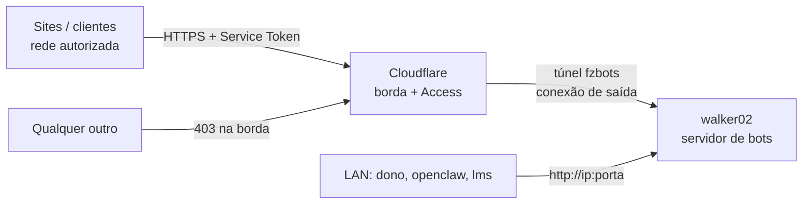
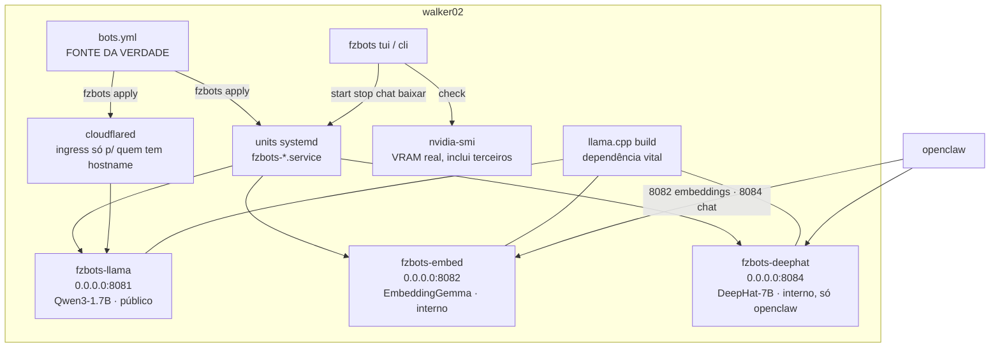

# Arquitetura — fzmultibotbackend

Modelo C4 simplificado (nível 1 e 2) + fluxo. Decisões com os porquês: `docs/adr/`.

## Nível 1 — o sistema no mundo

## Nível 2 — dentro do walker02

## O fluxo de uma pergunta (bot público)

1. Cliente chama `https://<hostname>/v1/chat/completions` com os 2 headers do Service Token.
2. Cloudflare Access confere: token válido **E** IP na rede autorizada. Falhou → 403, nem chega aqui.
3. Passou → entra pelo túnel → cloudflared entrega no `127.0.0.1:<porta>` do bot dono do hostname.
4. llama-server responde; volta pelo mesmo caminho.

Na LAN o caminho é direto: `http://<ip-do-walker02>:<porta>/v1/...` (ver `fzbots url`).

## Módulos

| Módulo | Onde | Papel |
|---|---|---|
| Declaração | `bots.yml` | nome, porta, modelo, VRAM estimada, flags, hostname, `tunel`, `consumidores` |
| `fzbots/config.py` | pacote | lê, valida (chaves, nome, porta/hostname únicos, `tunel` booleano) e renderiza unit + ingress |
| `fzbots/systemd.py` | pacote | `apply` (valida tudo, arquiva, grava atômico), `check` (drift em 5 eixos), `prune`, start/stop/restart/logs, `undo` |
| `fzbots/gpu.py` | pacote | VRAM real por processo/unit via nvidia-smi + cgroup; trava = yml + terceiros ≤ GPU |
| `fzbots/cli.py` | pacote | `fzbots apply|check|status|list|render|start|stop|restart|logs|url|vram|undo` |
| `scripts/*.sh` | atalhos | `aplicar.sh`, `status.sh`, `undo.sh` chamam a CLI; `test-tunnel.sh` testa os bots públicos pelo túnel |

## O que o `fzbots check` confere (drift)

a) cada unit em `/etc/systemd/system` é byte-igual ao render do yml; ingress igual ·
b) units `fzbots-*` órfãs (fora do yml) e quem depende delas ·
c) processo no ar × ExecStart da unit (unit alterada sem restart) e `daemon-reload` pendente ·
d) cloudflared ativo e config mais nova que o start ·
e) GPU real: soma do yml + VRAM de terceiros ≤ `gpu_vram_gb`; bot usando > 1,3× a estimativa; porta de bot ocupada por processo de fora.

## Invariantes (o que NUNCA muda sem decisão explícita do dono)

- Todo bot escuta em `0.0.0.0` (ADR 0006). A única entrada pela internet é o túnel.
- 1 bot = 1 porta + 1 unit + 1 modelo (isolamento por processo, ADR 0004). Bot público tem também 1 hostname.
- `bots.yml` → `fzbots apply` é o único caminho de mudança de units/ingress (ADR 0003).
- Só bot com `hostname` e sem `tunel: false` ganha ingress. `deephat` nunca é público.
- openclaw e lms são consumidores externos, sem adapters (ADR 0007).
- Porta 8081 é reservada ao bot público `llama` (o runbook do projeto Pangeia também usa 8081 — não subir os dois juntos).
- Segurança adicional é tratada pelo dono em outras camadas — não neste repo.
