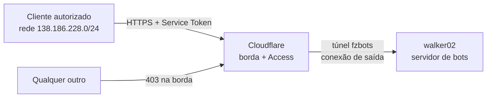
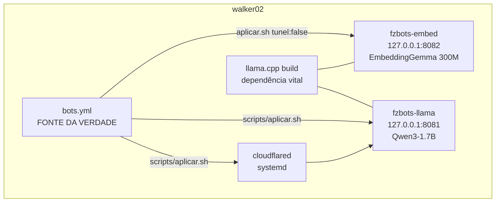

# Arquitetura — fzmultibotbackend

Modelo C4 simplificado (nível 1 e 2) + fluxo. Decisões com os porquês: `docs/adr/`.

## Nível 1 — o sistema no mundo

## Nível 2 — dentro do walker02

## O fluxo de uma pergunta

1. Cliente chama `https://<hostname>/v1/chat/completions` com os 2 headers do Service Token.
2. Cloudflare Access confere: token válido **E** IP na rede autorizada. Falhou → 403, nem chega aqui.
3. Passou → entra pelo túnel → cloudflared entrega no `127.0.0.1:<porta>` do bot dono do hostname.
4. llama-server responde; volta pelo mesmo caminho.

## Invariantes (o que NUNCA muda sem decisão explícita)

- Bot escuta só em `127.0.0.1` — a única porta pro mundo é o túnel.
- 1 bot = 1 hostname + 1 porta + 1 unit + 1 modelo (isolamento por processo).
- `bots.yml` → `aplicar.sh` é o único caminho de mudança de units/ingress.
- Modelos privados **nunca** entram no túnel — só bot com hostname e sem `tunel: false` ganha ingress.
- Bot interno (`tunel: false`) existe no yml e no systemd; o Cloudflare não o vê.
- Segurança adicional é tratada pelo dono em outras camadas — não neste repo.
