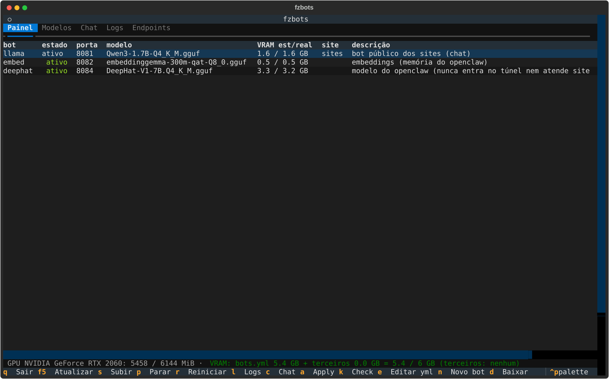
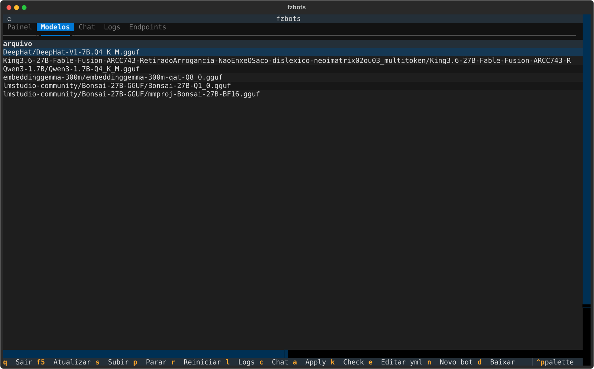

# TUI — `fzbots tui`

A interface do dono. Tudo que ela faz chama as mesmas funções da CLI (`fzbots/*.py`); a TUI não
tem lógica própria. Precisa do `python3-textual` (o `install.sh` instala).

## Abas

| Aba | O que mostra | Teclas |
|---|---|---|
| **Painel** | cada bot do `bots.yml`: estado (unit + `/health`), porta, modelo, VRAM estimada/real, site, descrição, consumidores; processos llama-server **de fora** do yml aparecem como `(externo)`; rodapé com a GPU e a trava de VRAM (verde = cabe) | `s` subir · `p` parar · `r` reiniciar · `l` logs · `c` chat · `a` apply --restart · `k` check · `e` editar o bots.yml no `$EDITOR` · `F5` atualizar |
| **Modelos** | todo `.gguf` de `modelos_dir`: tamanho, quant, arquitetura, ctx máximo, **VRAM estimada** (lida do cabeçalho GGUF: pesos + KV cache), cabe na VRAM livre agora?, quais bots usam | `n` novo bot com o modelo selecionado · `d` baixar do Hugging Face |
| **Chat** | conversa com um bot (stream); modelos que "pensam" (Qwen3) mostram `(pensando…)` até a resposta; tokens/s no fim | escolha o bot, digite, Enter |
| **Logs** | `journalctl -f` da unit do bot escolhido | escolha o bot |
| **Endpoints** | URLs local / rede / túnel de cada bot, com `curl` pronto; para bots públicos, os nomes dos headers do Service Token (valores só no arquivo 600) | — |

A faixa inferior ("saída") mostra o resultado de cada ação. `q` sai.

## Novo bot (tecla `n` na aba Modelos)

Formulário: nome, porta (sugerida = maior porta + 1), contexto, hostname (vazio = bot interno,
`tunel: false`), descrição, site, alias, "bot de embedding". **Ver flags** mostra os `extra_args`
que `fzbots flags` sugere e o porquê (cabe na VRAM livre → `-ngl 99`, senão `--fit on`; `-fa on`;
KV `q8_0` para ctx ≥ 8192; `--embedding -b -ub` para embedders; `--jinja`). **Criar e aplicar**:
acrescenta o bloco ao `bots.yml` (cópia anterior em `archived/`, comentários preservados),
roda `apply` e sobe a unit. A trava de VRAM real é conferida antes de subir.

## Baixar (tecla `d`)

Repo do Hugging Face + arquivo `.gguf`. Sem arquivo, lista os `.gguf` do repo na saída para
escolher. Progresso na saída; ao terminar o modelo aparece na aba Modelos.

## Teste sem terminal

`PYTHONPATH=. python3 tests/tui_headless.py` roda a TUI em modo headless (Textual `run_test`):
carrega o painel, roda `check`, lista modelos, conversa com o `llama`, segue os logs do `embed`
e grava os SVGs de `docs/screenshots/`. Com `--novo-bot` cria de verdade um bot `tuiteste` a
partir de `models/tinyllamas/stories260K.gguf` (baixe antes com `fzbots baixar ggml-org/models
tinyllamas/stories260K.gguf`), sobe, confere `/health` e deixa no yml para você remover
(`apply --prune` depois de tirar o bloco).
